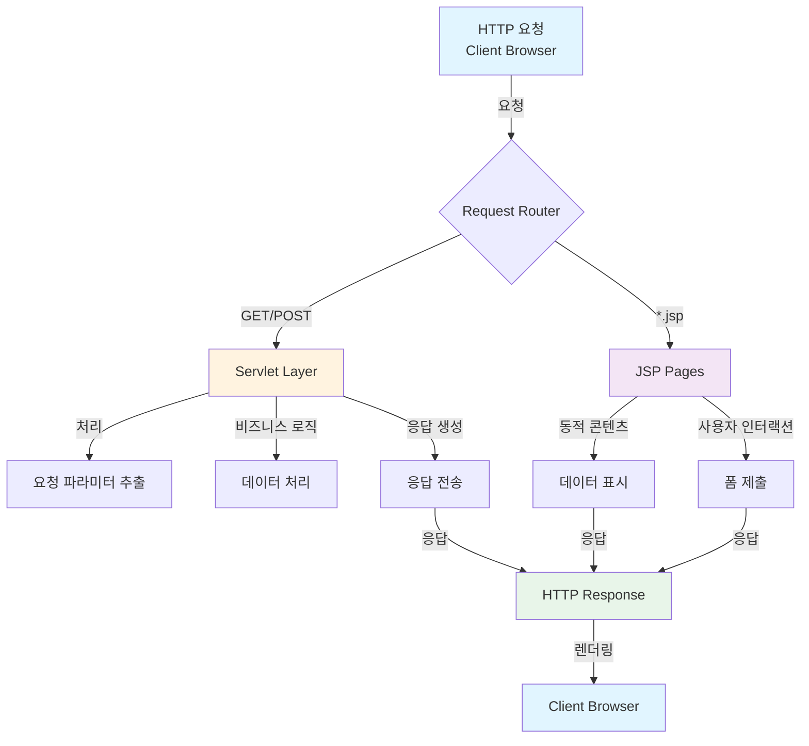
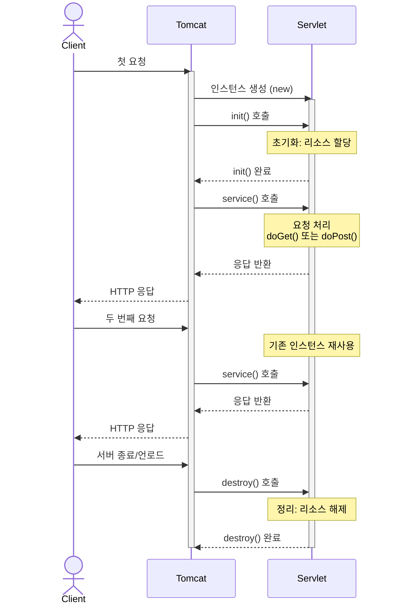
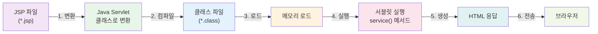

# 📚 ex03 - Java Web Application Advanced

> Java Servlet과 JSP를 이용한 고급 웹 애플리케이션 학습 프로젝트

## 📋 프로젝트 개요

이 프로젝트는 Java의 Servlet과 JSP(JavaServer Pages)를 활용하여 고급 동적 웹 애플리케이션을 개발하는 방법을 학습하는 프로젝트입니다.

**주요 기술 스택:**
- ☕ **Java 100%**
- 🚀 **Servlet**: HTTP 요청 처리 및 동적 응답 생성
- 📄 **JSP**: 서버 사이드 템플릿 엔진으로 HTML 생성
- 🔐 **세션 관리**: 사용자 상태 유지
- 📨 **요청/응답 처리**: 폼 데이터 처리 및 검증

---

## 🏗️ 프로젝트 아키텍처



---

## 📁 프로젝트 구조

```
ex03/
├── src/main/
│   ├── java/
│   │   └── org/scoula/ex3/
│   │       ├── [Servlet 클래스들]
│   │       └── [Utility 클래스들]
│   │
│   └── webapp/
│       ├── WEB-INF/
│       │   └── web.xml               📋 배포 설명자
│       ├── index.jsp                 🏠 메인 페이지
│       ├── [여러 JSP 페이지들]
│       └── [정적 자원들]
```

---

## 🔧 핵심 컴포넌트 분석

### 1️⃣ **Servlet 클래스들**

Servlet 클래스들은 HTTP 요청을 처리하고 동적 응답을 생성합니다.

**주요 기능:**
- GET/POST 요청 처리
- 요청 파라미터 추출 및 검증
- 한글 인코딩 처리
- 응답 생성 및 전송

### 2️⃣ **JSP 페이지들**

JSP는 서버 사이드 템플릿 엔진으로 동적 HTML을 생성합니다.

**주요 기능:**
- 동적 콘텐츠 렌더링
- 사용자 입력 폼 제공
- 데이터 표시
- 세션/쿠키 관리

### 3️⃣ **배포 설정**

#### **web.xml** - Deployment Descriptor
```xml
<?xml version="1.0" encoding="UTF-8"?>
<web-app xmlns="http://xmlns.jcp.org/xml/ns/javaee"
         xmlns:xsi="http://www.w3.org/2001/XMLSchema-instance"
         xsi:schemaLocation="http://xmlns.jcp.org/xml/ns/javaee 
         http://xmlns.jcp.org/xml/ns/javaee/web-app_4_0.xsd"
         version="4.0">

    <!-- Servlet 정의 및 매핑 -->
    
</web-app>
```

**📝 설명:**
- `<servlet>`: 서블릿 클래스 등록
- `<servlet-mapping>`: URL 패턴과 서블릿 연결

---

## 🎯 Servlet 생명주기 흐름



---

## 📌 JSP 처리 흐름



---

## 🚀 JSP 주요 문법

### 스크립트릿 (Scriptlet)
```jsp
<% 
    // Java 코드 작성
    int x = 10;
    String name = "Korean";
%>
```

### 표현식 (Expression)
```jsp
<%= x %>                    <!-- 변수 출력 -->
<%= "Hello " + name %>      <!-- 식 계산 및 출력 -->
```

### 지시어 (Directive)
```jsp
<%@ page import="java.util.*" %>
<%@ page contentType="text/html; charset=UTF-8" %>
<%@ include file="header.jsp" %>
```

### 주석 (Comments)
```jsp
<%-- JSP 주석: 브라우저에 전송 안 됨 --%>
<!-- HTML 주석: 브라우저에 전송됨 -->
```

### 내장 객체 (Implicit Objects)
```jsp
<% 
    out.print("출력");           // PrintWriter
    String param = request.getParameter("name");  // HttpServletRequest
    response.setContentType("text/html");         // HttpServletResponse
%>
```

---

## 🔐 보안 및 인코딩

| 항목 | 설정 | 목적 |
|------|------|------|
| **문자 인코딩** | `charset=UTF-8` | 한글 깨짐 방지 |
| **Content-Type** | `text/html` | MIME 타입 지정 |
| **XSS 방지** | `out.print()` | 스크립트 태그 안전 처리 |
| **세션 관리** | `session` 객체 | 사용자 상태 유지 |

---

## 💡 학습 포인트

### ✅ Servlet 학습 목표
- [ ] Servlet 기본 구조 이해
- [ ] 생명주기 메서드 (init, doGet, doPost, destroy)
- [ ] HttpRequest/HttpResponse 처리
- [ ] 한글 인코딩 처리
- [ ] @WebServlet 어노테이션 사용
- [ ] 고급 요청 처리 기법

### ✅ JSP 학습 목표
- [ ] JSP 문법 (스크립트릿, 표현식, 지시어)
- [ ] 내장 객체 (request, response, out, session)
- [ ] 페이지 포함 (`<%@include %>`)
- [ ] 동적 HTML 생성
- [ ] 폼 데이터 처리
- [ ] 고급 데이터 표시 기법

---

## 📚 참고 자료

- [Java Servlet API Documentation](https://docs.oracle.com/javaee/7/api/javax/servlet/package-summary.html)
- [JSP 2.3 Specification](https://projects.eclipse.org/projects/ee4j.jsp)
- [Apache Tomcat Documentation](https://tomcat.apache.org/tomcat-10.0-doc/)

---

## 👨‍💻 개발 환경

- **JDK**: Java 8 이상
- **Servlet API**: 4.0
- **WAS**: Apache Tomcat 9.0+
- **IDE**: IntelliJ IDEA / Eclipse

---

<br>


